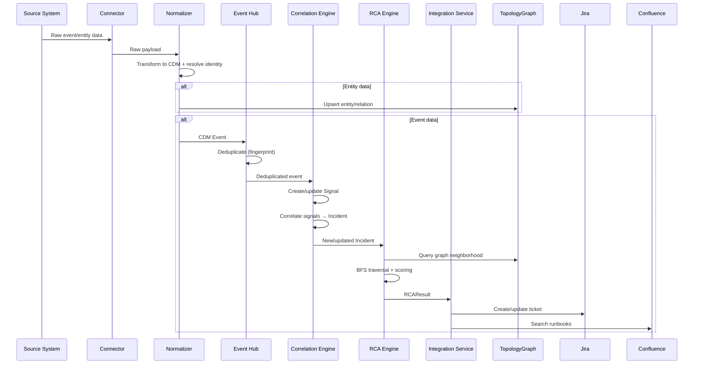

# AIOps Platform — Detailed Architecture

## 1. Component Interactions

### Event Processing Sequence



## 2. API Contracts (Key Endpoints)

### Topology API
- `GET /api/v1/topology/entities` — List entities with filtering
- `GET /api/v1/topology/entities/{id}` — Get entity details
- `GET /api/v1/topology/entities/{id}/neighbors` — Get connected entities
- `GET /api/v1/topology/relations` — List relations
- `GET /api/v1/topology/graph` — Get full graph (paginated)
- `GET /api/v1/topology/path/{from_id}/{to_id}` — Find shortest path

### Incidents API
- `GET /api/v1/incidents` — List incidents with status filter
- `GET /api/v1/incidents/{id}` — Get incident details
- `PATCH /api/v1/incidents/{id}` — Update incident (status, owner)
- `GET /api/v1/incidents/{id}/rca` — Get RCA result for incident
- `GET /api/v1/incidents/{id}/timeline` — Get event timeline

### Events API
- `GET /api/v1/events` — List events with filtering
- `POST /api/v1/events` — Inject event (webhook)
- `GET /api/v1/signals` — List signals

### Connectors API
- `GET /api/v1/connectors` — List configured connectors
- `POST /api/v1/connectors` — Register new connector
- `POST /api/v1/connectors/{id}/sync` — Trigger manual sync
- `GET /api/v1/connectors/{id}/health` — Connector health

### Admin API
- `GET /api/v1/health` — Platform health
- `GET /api/v1/config` — Platform configuration
- `GET /api/v1/audit` — Audit log

## 3. Configuration Model

```yaml
# config.yaml
platform:
  name: "AIOps Platform"
  version: "1.0.0"
  log_level: "${LOG_LEVEL:INFO}"

connectors:
  dynatrace:
    enabled: true
    base_url: "${DYNATRACE_URL}"
    api_token: "${DYNATRACE_API_TOKEN}"
    poll_interval_seconds: 300
  solarwinds:
    enabled: true
    base_url: "${SOLARWINDS_URL}"
    username: "${SOLARWINDS_USER}"
    password: "${SOLARWINDS_PASS}"
    poll_interval_seconds: 600
  splunk:
    enabled: true
    base_url: "${SPLUNK_URL}"
    token: "${SPLUNK_HEC_TOKEN}"
    mode: webhook  # or poll

correlation:
  time_window_seconds: 300
  min_signals_for_incident: 2

rca:
  algorithm: "topo-walk-v1"
  max_candidates: 3
  max_traversal_depth: 5

integration:
  jira:
    enabled: true
    base_url: "${JIRA_URL}"
    api_token: "${JIRA_API_TOKEN}"
    project_key: "${JIRA_PROJECT_KEY}"
    auto_create_severity: ["critical", "high"]
  confluence:
    enabled: true
    base_url: "${CONFLUENCE_URL}"
    api_token: "${CONFLUENCE_API_TOKEN}"
    space_key: "${CONFLUENCE_SPACE_KEY}"

storage:
  backend: "sqlite"  # sqlite | postgresql
  sqlite_path: "./data/aiops.db"
  # postgresql_url: "${DATABASE_URL}"

auth:
  mode: "api_key"  # api_key | jwt | oidc
```

## 4. Scaling Strategy

| Phase | Architecture | Deployment | Event Throughput |
|-------|-------------|------------|-----------------|
| **v1** | Monolith (single process) | docker-compose, single node | 500 events/s |
| **v2** | Modular monolith with async queues | Kubernetes, Redis for queues | 2,000 events/s |
| **v3** | Microservices with Kafka | Kubernetes HA, Kafka, Neo4j | 5,000+ events/s |

## 5. Error Handling

- **Connector failures**: Circuit breaker pattern (5 failures → open, 60s recovery → half-open)
- **Event processing errors**: Dead letter queue for failed events, retry with exponential backoff
- **RCA timeout**: 30s budget, return partial results if exceeded
- **Integration failures**: Queue actions, retry with backoff, max 24h retention

## 6. Platform Observability

- **Structured logging**: JSON with timestamp, level, service, event, trace_id, duration_ms
- **Metrics**: Prometheus format — connector_poll_duration, events_ingested_total, incidents_active, rca_duration_seconds, topology_entities_total
- **Health checks**: `/health` (liveness), `/health/ready` (readiness)
- **Tracing**: OpenTelemetry SDK (v2) with W3C Trace Context propagation
