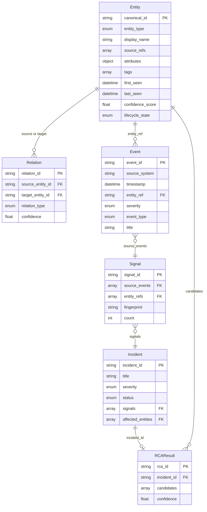

# Canonical Data Model v1

> **Version:** 1.0.0 | **Status:** Draft | **Date:** 2026-02-25

## Overview

The CDM is the vendor-neutral core schema. Vendor-specific representations exist only inside connectors; once data crosses the connector boundary it conforms to these types.

## Enumerations

### entity_type
`host`, `vm`, `container`, `pod`, `namespace`, `service`, `application`, `network_device`, `network_interface`, `load_balancer`, `database`, `cloud_resource`, `storage`, `queue`, `business_service`, `workload`

### relation_type
`runs_on`, `hosts`, `connects_to`, `depends_on`, `member_of`, `routes_through`, `load_balances`, `stores_data_in`, `calls`, `peers_with`, `attached_to`, `owns`, `composed_of`, `deploys_to`, `affects`

### severity
`critical` (1), `high` (2), `medium` (3), `low` (4), `info` (5)

### event_type
`metric_threshold`, `log_pattern`, `state_change`, `trap`, `alert`, `deployment`, `audit`, `custom`

### incident_status
`open`, `acknowledged`, `investigating`, `resolved`, `closed`

### lifecycle_state
`active`, `inactive`, `decommissioned`, `soft_deleted`

## Core Type Definitions

### 1. Entity

| Field | Type | Required | Description |
|-------|------|----------|-------------|
| canonical_id | string | Y | Deterministic unique ID (see identity-resolution.md) |
| entity_type | enum | Y | Classification |
| display_name | string | Y | Human-readable name |
| source_refs | array\<SourceRef\> | Y | References to source systems [{source_system, native_id, last_sync}] |
| attributes | object | N | Free-form key-value attributes |
| tags | array\<string\> | N | Tags for filtering |
| first_seen | datetime | Y | First discovery timestamp |
| last_seen | datetime | Y | Most recent observation |
| confidence_score | float 0-1 | N | Identity resolution confidence (default 1.0) |
| lifecycle_state | enum | Y | Current state |

### 2. Relation

| Field | Type | Required | Description |
|-------|------|----------|-------------|
| relation_id | string | Y | Unique ID |
| source_entity_id | string | Y | Source entity canonical_id |
| target_entity_id | string | Y | Target entity canonical_id |
| relation_type | enum | Y | Semantic type |
| source_system | string | Y | Discovering system |
| confidence | float 0-1 | N | Confidence score |
| discovered_at | datetime | Y | First observed |
| last_seen | datetime | N | Most recent observation |
| properties | object | N | Additional metadata (port, protocol, etc.) |

### 3. Event

| Field | Type | Required | Description |
|-------|------|----------|-------------|
| event_id | string | Y | Platform-assigned ID |
| source_system | string | Y | Originating system |
| source_event_id | string | N | Native ID in source |
| timestamp | datetime | Y | When event occurred |
| entity_ref | string | N | canonical_id of related entity |
| severity | enum | Y | Normalized severity |
| event_type | enum | Y | Classification |
| title | string | Y | Short summary |
| description | string | N | Longer description |
| raw_payload | object | N | Original payload (audit) |
| tags | array\<string\> | N | Tags |

### 4. Signal

| Field | Type | Required | Description |
|-------|------|----------|-------------|
| signal_id | string | Y | Unique ID |
| source_events | array\<string\> | Y | Contributing event_ids |
| entity_refs | array\<string\> | Y | Affected entity canonical_ids |
| severity | enum | Y | Highest from source events |
| category | string | Y | Functional category (memory, network, latency, etc.) |
| fingerprint | string | Y | Deterministic dedup key |
| first_occurrence | datetime | Y | Earliest source event |
| last_occurrence | datetime | Y | Most recent source event |
| count | integer | Y | Deduplicated event count |
| enrichments | object | N | Topology context, runbook links, etc. |

### 5. Incident

| Field | Type | Required | Description |
|-------|------|----------|-------------|
| incident_id | string | Y | Unique ID |
| title | string | Y | Summary |
| severity | enum | Y | Highest across signals |
| status | enum | Y | Lifecycle status |
| signals | array\<string\> | Y | Grouped signal_ids |
| affected_entities | array\<string\> | Y | Union of entity_refs |
| root_cause_candidates | array\<string\> | N | Suspected root-cause entity IDs |
| created_at | datetime | Y | Creation time |
| updated_at | datetime | Y | Last update |
| owner | string | N | Assigned user/team |
| external_refs | array\<ExternalRef\> | N | [{system, ref_id, url}] |

### 6. RCAResult

| Field | Type | Required | Description |
|-------|------|----------|-------------|
| rca_id | string | Y | Unique ID |
| incident_id | string | Y | Analyzed incident |
| candidates | array\<RCACandidate\> | Y | [{entity_id, score, evidence_path[], explanation}] |
| algorithm_version | string | Y | Algorithm version |
| computed_at | datetime | Y | Computation timestamp |
| confidence | float 0-1 | Y | Overall confidence |

### 7. ChangeEvent

| Field | Type | Required | Description |
|-------|------|----------|-------------|
| change_id | string | Y | Unique change identifier |
| source_system | enum | Y | CI/CD system (jenkins, gitlab_ci, github_actions, argocd, azure_devops, custom) |
| source_change_id | string | N | Native ID in source system |
| service_canonical_id | string | Y | canonical_id of service being deployed |
| environment | enum | Y | Target environment (dev, staging, production, canary) |
| version | string | Y | Version being deployed |
| previous_version | string | N | Version before deployment |
| timestamp_start | datetime | Y | Deployment start |
| timestamp_end | datetime | N | Deployment end |
| actor | string | N | User or automation that triggered |
| pipeline | string | N | Pipeline name |
| status | enum | Y | started, succeeded, failed, rolled_back |
| commit_sha | string | N | Git commit |
| affected_entities | array\<string\> | N | Canonical IDs of affected entities |
| metadata | object | N | Free-form plugin-specific data |

## Schema Versioning

- Semantic Versioning: MAJOR.MINOR.PATCH
- MAJOR: Breaking changes. MINOR: Backward-compatible additions. PATCH: Docs only.
- Records carry `_schema_version` field (default: "1.0.0")

## Conventions

- Timestamps: ISO 8601 UTC
- IDs: UTF-8 strings, opaque to consumers
- Wire format: JSON for APIs; Avro/Protobuf for high-throughput streams (v2)
- Null handling: absent optional fields omitted (not set to null)
