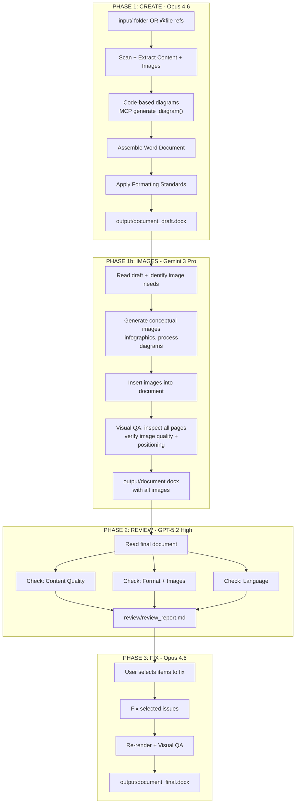
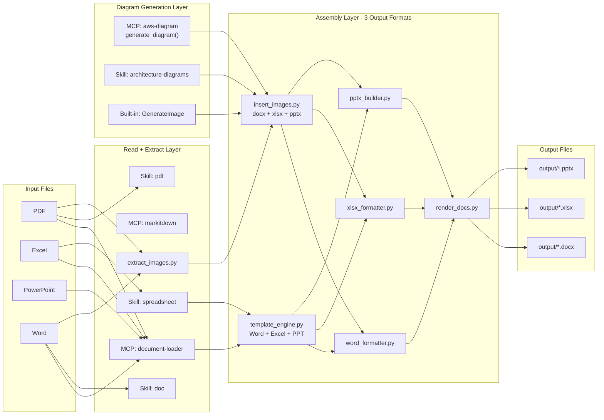
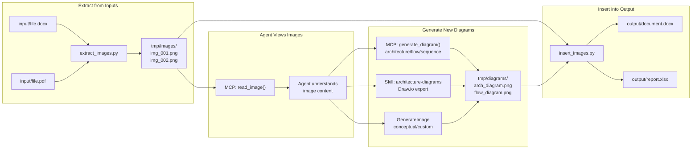
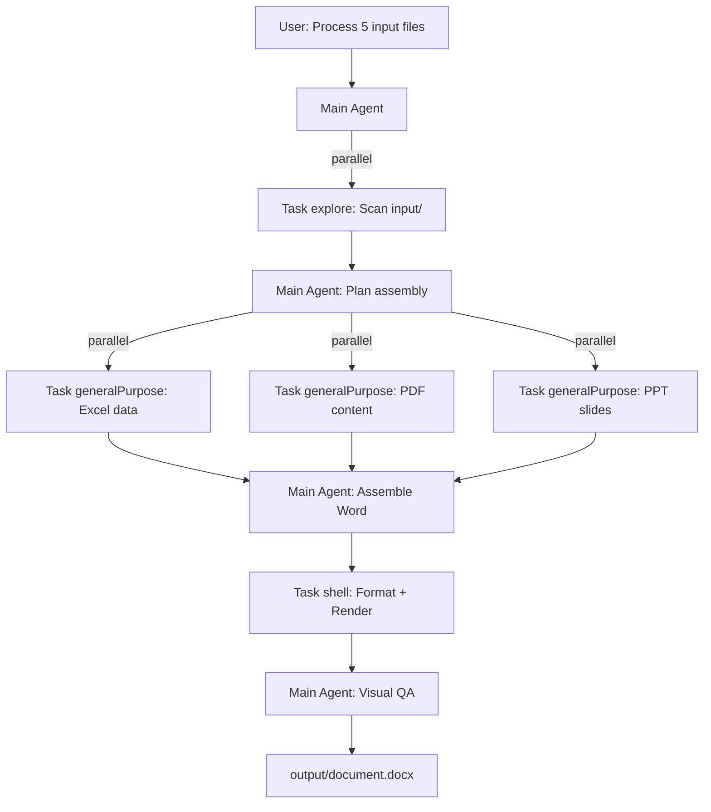

# Document Processing Workflow with Cursor AI Agents

## What You Need (One-Time Setup)

All interaction happens **exclusively in Cursor**. You never need to open Terminal, Docker Desktop, or any other tool manually.


| Requirement              | What It Does                                                | Install Once                                  |
| ------------------------ | ----------------------------------------------------------- | --------------------------------------------- |
| **Cursor IDE**           | Your ONLY interface for the entire workflow                 | Already have it                               |
| **Python + uv**          | Runs helper scripts (Agent calls them automatically)        | `brew install uv`                             |
| **Docker + LibreOffice** | Renders documents to PNG for visual QA (runs in background) | `brew install docker && docker compose up -d` |
| **MCP Servers**          | Agent tools for reading documents and generating diagrams   | Configure in Cursor Settings > MCP            |


### What You Do NOT Need

- No terminal usage (Agent runs all commands via Shell tool)
- No manual Docker commands (docker-compose runs LibreOffice as a service)
- No Python scripting (Agent writes and runs scripts automatically)
- No manual file copying (Agent reads from `input/` and writes to `output/`)
- No prompt engineering (Opus auto-generates handoff files for each phase transition)
- No copy-pasting long prompts (just type "Execute @tmp/handoff/phaseX.md")

### Your Only Tasks as a User

1. Put files in `input/` folder (or use `@file` references)
2. **Phase 1**: Open Cursor chat, select Opus 4.6, write your request
3. **Phase 1b/2/3**: Open NEW chat, select model, type `Execute @tmp/handoff/phaseX.md`
4. (Optional) Glance at output between phases
5. Done when Opus says "DONE" in Phase 3

**Total typing for phases 1b-3: "Execute @tmp/handoff/phase__.md" (5 words each)**

## Problem Statement

As a Technical Lead working on tender/bid documentation and technical reports, you face pain points:

- Manually extracting data from PDFs, Excel, PowerPoint into Word documents
- Inconsistent formatting across Word documents
- Time-consuming template filling and content consolidation
- No standard workflow for AI-assisted document processing

## Key Insight: Leverage Built-in Capabilities

Instead of building everything from scratch, this plan maximizes use of what Cursor already provides:

### Built-in Skills (Auto-triggered by Agent)

- **doc skill** (`~/.codex/skills/doc/SKILL.md`): Full Word workflow with `python-docx`, LibreOffice rendering, visual QA
- **pdf skill** (`~/.codex/skills/pdf/SKILL.md`): PDF reading via `pdfplumber`, rendering to PNG for inspection
- **spreadsheet skill** (`~/.codex/skills/spreadsheet/SKILL.md`): Excel read/write via `openpyxl`/`pandas`, formula preservation, formatting

### MCP Servers (Available as Agent tools)

- **document-loader-mcp-server**: `read_document(file_path, file_type)` - reads PDF, Word, Excel, PowerPoint directly
- **document-loader-mcp-server**: `read_image(file_path)` - view rendered PNGs for visual QA
- **markitdown**: `convert_to_markdown(uri)` - converts any document to Markdown for easy content processing
- **aws-diagram-mcp-server**: `generate_diagram(code)` - code-based architecture/flow diagrams

### Agent/Subagent Architecture (Task tool)

- **explore** subagent: Fast scanning of multiple input files in parallel
- **generalPurpose** subagent: Complex content transformation, multi-step document assembly
- **shell** subagent: Run Python scripts, rendering commands, file operations

## Research: Model Capabilities for Document Workflow

Based on current model capabilities (researched Feb 2026):

### Image Generation Capabilities


| Model            | Native Image Generation | Notes                                                                              |
| ---------------- | ----------------------- | ---------------------------------------------------------------------------------- |
| **Claude Opus**  | NO                      | Cannot generate images. Can create SVG code or descriptions only                   |
| **GPT-5**        | NO (external)           | Uses external GPT Image 1.5 ($0.08-0.12/img). Strong text rendering (94% accuracy) |
| **Gemini 3 Pro** | YES (native)            | Native multimodal output. 3-5 sec, up to 4K. Strong at charts/infographics         |


Key finding: **Only Gemini 3 Pro can natively generate images**. Claude cannot generate images at all. GPT delegates to external image models.

### Image Understanding Capabilities


| Model            | Strength                                                       | Best For                                                        |
| ---------------- | -------------------------------------------------------------- | --------------------------------------------------------------- |
| **Opus 4.6**     | Document-focused vision, "computer vision zoom" for small text | PDFs, technical diagrams, screenshots, structured docs          |
| **GPT-5.2**      | Contextual understanding, relationship inference               | Creative scenes, content moderation, complex compositions       |
| **Gemini 3 Pro** | Native multimodal (no conversion layers), 1M token context     | Sequential image analysis, cross-image context, large documents |


### Cursor Built-in `GenerateImage` Tool

Uses **OpenAI GPT Image API** under the hood. Works regardless of which chat model is selected. Produces good quality but is an API call to OpenAI, not native to the chat model.

### Recommended 4-Model Strategy

Based on research, each model has clear strengths. The optimal strategy assigns each model to its specialty:


| Phase                | Cursor Model                        | Why This Model (Research-backed)                                                                                           |
| -------------------- | ----------------------------------- | -------------------------------------------------------------------------------------------------------------------------- |
| **Phase 1: CREATE**  | **Opus 4.6**                        | Best reasoning/coding. Best at document analysis, structured content extraction, python-docx code generation               |
| **Phase 1b: IMAGES** | **Gemini 3 Pro**                    | ONLY model with native image generation. Fastest (3-5s). Strong at charts, infographics, multi-turn editing                |
| **Phase 2: REVIEW**  | **GPT-5.2 High**                    | Strongest GPT variant. Best contextual understanding, structured checklists. Fresh perspective from different model family |
| **Phase 3: FIX**     | **Opus 4.6**                        | Best at precise code edits, applying targeted fixes without breaking existing content                                      |
| **Quick edits**      | **Opus 4.6 Fast** or **Sonnet 4.5** | For trivial edits like "rename this section" or "fix one table" -- faster and cheaper                                      |


### All Available Cursor Models and When to Use Them


| Cursor Model      | Best For in This Workflow                                                              |
| ----------------- | -------------------------------------------------------------------------------------- |
| **Opus 4.6**      | Phase 1 CREATE + Phase 3 FIX. Primary workhorse for document creation and editing      |
| **Opus 4.6 Fast** | Quick single-file edits, minor formatting fixes. Faster variant of Opus                |
| **Opus 4.5**      | Fallback if 4.6 has issues. Slightly older but still very capable                      |
| **Sonnet 4.5**    | Budget option for simple tasks. Good enough for reformatting, not for complex assembly |
| **GPT-5.2**       | Phase 2 REVIEW (standard). Good for most review tasks                                  |
| **GPT-5.2 High**  | Phase 2 REVIEW (thorough). Use for critical documents that need deep review            |
| **GPT-5.2 Codex** | Not recommended for this workflow (specialized for code, not documents)                |
| **Gemini 3 Pro**  | Phase 1b IMAGES. The only model that can natively generate images                      |
| **Composer 1**    | Not recommended (Cursor's own model, less capable than the others for this use case)   |


### Why NOT Use One Model for Everything?

- Opus 4.6 is best at creating docs but CANNOT generate images (Anthropic architectural limitation)
- Gemini 3 Pro can generate images natively but is not as strong at complex code/reasoning tasks
- GPT-5.2 provides valuable "second opinion" for review but delegates image generation externally
- Using different model families for review catches errors that the creating model's blind spots would miss

## End-to-End Workflow: 4-Phase Multi-Model Pipeline




### How the 4 Phases Work in Practice

**Phase 1 -- CREATE (Model: Opus 4.6, Mode: Agent)**

You open a new Cursor chat, select **Opus 4.6**, and give it your input files. Opus reads sources via MCP tools and built-in skills, extracts content and images, generates code-based diagrams (via MCP `generate_diagram()`), assembles the Word document, applies formatting, sets author metadata, and saves draft to `output/`. If no conceptual images are needed, skip Phase 1b and go directly to Phase 2.

**Phase 1b -- IMAGES (Model: Gemini 3 Pro, Mode: Agent)**

You open a NEW Cursor chat, switch to **Gemini 3 Pro**. Gemini reads the draft, identifies where conceptual images/infographics are needed, generates them natively (3-5 seconds each, up to 4K), inserts them at correct positions, then does visual QA by rendering pages to PNG and inspecting them. Gemini's native multimodal architecture means it generates AND verifies images in one flow.

**Phase 2 -- REVIEW (Model: GPT-5.2 High, Mode: Agent)**

You open a NEW Cursor chat, switch to **GPT-5.2 High**. GPT reads the document, checks content quality / formatting / language / image positioning, and writes a structured review report to `review/review_report.md`. Using a different model family catches errors the creating models' blind spots would miss.

**Phase 3 -- FIX (Model: Opus 4.6, Mode: Agent)**

You open a NEW Cursor chat, switch back to **Opus 4.6**, show it the review report, tell it which items to fix. Opus fixes them, re-renders, updates author metadata, and delivers the final document.

### When to Skip Phase 1b (Gemini)

**Skip** when:

- Document only needs code-based diagrams (architecture, flow, sequence) -- MCP handles this in Phase 1
- No conceptual images, infographics, or illustrations needed
- Images from input files are just carried over without modification

**Use** when:

- You need conceptual/process diagrams that code cannot express well
- You need infographics, charts, or custom illustrations
- You want AI-native visual QA (Gemini "sees" layout issues better)
- Input images need to be analyzed and potentially recreated at higher quality

### Why This Specific Model Assignment? (Research-backed)

- **Opus 4.6 CANNOT generate images** -- Anthropic architectural limitation
- **Gemini 3 Pro is the ONLY Cursor model with native image generation** -- 3-5 sec, up to 4K resolution
- **GPT-5.2 does not natively generate images** -- delegates to GPT Image 1.5 via external API
- **Cursor's built-in `GenerateImage` tool** uses OpenAI's image API -- works with any model but is external
- Using Gemini for images is faster AND more natural than the OpenAI image API
- **GPT-5.2 High** (not standard GPT-5.2) is recommended for review because it's the most thorough GPT variant
- Using a different model family for review catches "model blind spots" from creation phase

### Phase Handoff: @file Reference (Zero Copy-Paste)

**Limitation**: Cursor does NOT support automatically opening a new chat session with a different model. Each chat uses one model and there is no hook/API to chain sessions programmatically.

**Solution**: Instead of copy-pasting long prompts, use Cursor's `@file` reference. The Agent saves all context to a handoff file, and you type ONE short sentence in the next chat.

**Your interaction for the ENTIRE workflow:**

```
Phase 1 (Opus):    "Process @input/ files, create proposal using @templates/word/proposal_template.docx"
Phase 1b (Gemini): "Execute @tmp/handoff/phase1b.md"   <-- 5 words, always the same pattern
Phase 2 (GPT):     "Execute @tmp/handoff/phase2.md"    <-- 5 words
Phase 3 (Opus):    "Execute @tmp/handoff/phase3.md"    <-- 5 words
```

**You write 1 real prompt (Phase 1). Everything else is "Execute @file".**

### How It Works

At the end of every phase, the Agent:

1. Saves a structured handoff file to `tmp/handoff/phaseXX.md`
2. Tells you: "Open NEW chat, select [MODEL], type: `Execute @tmp/handoff/phaseXX.md`"

The next model reads the handoff file via `@file` reference and has ALL the context it needs. The Cursor Rule (`document-workflow.mdc`) teaches every model to recognize handoff files and execute them automatically.

### Handoff File Structure

Each handoff file follows a standard format that every model understands:

```markdown
# Handoff: Phase 1b (IMAGES)
## Select Model: Gemini 3 Pro

## Previous Phase Summary
- Phase 1 (CREATE) completed by Opus 4.6
- Draft saved to output/proposal_REVIEW.docx (42 pages, 3 tables, TOC)
- Pricing saved to output/pricing_REVIEW.xlsx (2 sheets, 15 items)
- Code diagrams generated and inserted (architecture.png)

## Tasks for This Phase
1. Read @output/proposal_REVIEW.docx
2. Generate images for these placeholders:
   - {{IMAGE:process_flow}} on page 12
     Description: Professional 5-step ingestion pipeline flow diagram
     matching section 3.2 content
   - {{IMAGE:infographic_metrics}} on page 28
     Description: Key metrics infographic - 99.9% uptime, <500ms latency,
     10M events/day
3. Insert generated images at placeholder positions
4. Run visual QA (render all pages, inspect image placement)
5. Save updated file to output/

## Files to Reference
- @output/proposal_REVIEW.docx (primary target)
- @output/pricing_REVIEW.xlsx (read-only, for data context)

## After This Phase
Generate handoff for Phase 2 (REVIEW) -> save to tmp/handoff/phase2.md
```

### Example: Full Workflow Interaction

```
=== Phase 1: CREATE ===
Chat: New | Model: Opus 4.6

YOU TYPE: "Process @input/ files, create proposal using
          @templates/word/proposal_template.docx"

... Opus works 5-10 min ...

OPUS SAYS: "Phase 1 COMPLETE.
  output/proposal_REVIEW.docx (42 pages)
  output/pricing_REVIEW.xlsx (2 sheets)
  2 image placeholders need Gemini.

  >>> Open NEW chat, select Gemini 3 Pro, type:
      Execute @tmp/handoff/phase1b.md"
```

```
=== Phase 1b: IMAGES ===
Chat: New | Model: Gemini 3 Pro

YOU TYPE: "Execute @tmp/handoff/phase1b.md"

... Gemini reads file, generates images, inserts, does QA ...

GEMINI SAYS: "Phase 1b COMPLETE.
  2 images generated and inserted.

  >>> Open NEW chat, select GPT-5.2 High, type:
      Execute @tmp/handoff/phase2.md"
```

```
=== Phase 2: REVIEW ===
Chat: New | Model: GPT-5.2 High

YOU TYPE: "Execute @tmp/handoff/phase2.md"

... GPT reads REVIEW versions, checks tracking, writes report ...

GPT SAYS: "Review COMPLETE. 12 findings (2 CRITICAL, 3 HIGH).
  review/review_report.md saved.

  >>> Open NEW chat, select Opus 4.6, type:
      Execute @tmp/handoff/phase3.md"
```

```
=== Phase 3: FIX ===
Chat: New | Model: Opus 4.6

YOU TYPE: "Execute @tmp/handoff/phase3.md"

... Opus reads review report, fixes issues, re-generates clean version ...

OPUS SAYS: "Phase 3 COMPLETE. All CRITICAL and HIGH items fixed.
  Final files in output/:
    proposal_REVIEW.docx (with fix tracking)
    proposal.docx (clean for client)
    pricing_REVIEW.xlsx (with fix tracking)
    pricing.xlsx (clean for client)

  DONE! Send the clean versions to client."
```

### Handoff File Naming Convention

```
tmp/handoff/
├── phase1b.md     # Created at end of Phase 1 (if images needed)
├── phase2.md      # Created at end of Phase 1 or 1b
├── phase3.md      # Created at end of Phase 2
└── history/       # Previous handoffs kept for audit trail
    ├── phase1b_20260209_143022.md
    └── phase2_20260209_144512.md
```

### The Cursor Rule Recognizes Handoff Files

In `document-workflow.mdc`:

```
## Handoff File Detection

When user message contains "Execute @tmp/handoff/" or references a handoff file:
1. Read the handoff file completely
2. Identify which phase this is (from the file header)
3. Verify you are the correct model for this phase
4. Execute the tasks listed in the file
5. At the end, generate the NEXT handoff file
6. Tell user the next step

When generating handoff files:
1. Use standard format (# Handoff: Phase XX)
2. Include COMPLETE context (the next model has zero prior context)
3. Use @file references for all document paths
4. Save to tmp/handoff/phaseXX.md
5. Archive previous handoff to tmp/handoff/history/
```

### Why @file Reference is Better Than Copy-Paste

- **5 words vs 20+ lines**: "Execute @tmp/handoff/phase2.md" vs copying a long prompt
- **No truncation risk**: Long prompts can get cut off when pasting. File reference sends complete content.
- **Richer context**: The handoff file can include detailed descriptions, file lists, specific instructions -- more than you'd want to paste manually
- **Audit trail**: All handoff files are saved in `tmp/handoff/history/` -- you can see exactly what was passed between phases
- **Consistent format**: Every model reads the same structured format, reducing misinterpretation
- **Still human-gated**: You open the new chat, select the model, confirm the handoff. No automation runs without your action.

### Why Separate Chat Sessions?

- Cursor does NOT support switching models within a single chat session
- Different models have fundamentally different capabilities (Opus: reasoning, Gemini: images, GPT: review)
- Clean context: each phase gets a fresh context focused on its job
- The handoff FILE carries all necessary context between phases (richer than a prompt)
- You control the gate: glance at output before typing "Execute @..."

## Folder Structure and File Flow

```
ho-so-thau/
├── input/                    # YOU PUT FILES HERE (or use @file refs)
│   ├── requirements.pdf
│   ├── pricing.xlsx
│   ├── slides.pptx
│   └── draft.docx
│
├── output/                   # AGENT PUTS RESULTS HERE
│   ├── proposal.docx         # Phase 1 draft
│   └── proposal_final.docx   # Phase 3 final
│
├── review/                   # GPT PUTS REVIEW REPORT HERE
│   └── review_report.md      # Structured findings + severity
│
├── templates/                # STANDARD TEMPLATES
│   ├── proposal_template.docx
│   ├── technical_report_template.docx
│   └── template_config.yaml
│
├── tmp/                      # TEMPORARY (auto-cleaned)
│   ├── renders/              # PNG pages for visual QA
│   ├── images/               # Extracted images from input files
│   └── diagrams/             # Generated diagrams before insertion
│
├── scripts/                  # HELPER SCRIPTS
├── .cursor/rules/            # AGENT BEHAVIOR RULES
├── chat/                     # CHAT HISTORY LOGS
└── ...
```

### Input Methods

**Method 1: Folder-based (batch processing)**
Copy files into `input/` folder, then tell Agent:

```
"Process all files in @input/ and create a proposal
 using @templates/proposal_template.docx"
```

**Method 2: Direct @reference (single file, anywhere on disk)**

```
"Read @/Users/steve/TechX/TCB/pricing.xlsx
 and update pricing in @output/proposal.docx"
```

Use Method 1 for big jobs (multiple sources -> one document).
Use Method 2 for quick single-file updates.

## Architecture: Built-in Tools Map




## What We Build vs What We Reuse

### Input (Read) Capabilities


| Capability                     | Built-in Tool                                          | Custom Script? |
| ------------------------------ | ------------------------------------------------------ | -------------- |
| Read PDF content               | `read_document(path, 'pdf')` + pdf skill               | NO             |
| Read Excel data                | `read_document(path, 'xlsx')` + spreadsheet skill      | NO             |
| Read PowerPoint                | `read_document(path, 'pptx')`                          | NO             |
| Read Word content              | `read_document(path, 'docx')` + doc skill              | NO             |
| Convert any doc to Markdown    | `convert_to_markdown(uri)`                             | NO             |
| View images for QA             | `read_image(path)`                                     | NO             |
| Generate architecture diagrams | MCP `generate_diagram()` + architecture-diagrams skill | NO             |
| Generate conceptual images     | Built-in `GenerateImage` tool                          | NO             |


### Output (Write) Capabilities -- per format


| Capability           | .docx (Word)                         | .xlsx (Excel)                             | .pptx (PowerPoint)                             |
| -------------------- | ------------------------------------ | ----------------------------------------- | ---------------------------------------------- |
| **Edit content**     | doc skill + `python-docx` (built-in) | spreadsheet skill + `openpyxl` (built-in) | `**pptx_builder.py**` + `python-pptx` (CUSTOM) |
| **Apply formatting** | `**word_formatter.py**` (CUSTOM)     | `**xlsx_formatter.py**` (CUSTOM)          | `**pptx_builder.py**` (CUSTOM)                 |
| **Fill template**    | `**template_engine.py**` (CUSTOM)    | `**template_engine.py**` (CUSTOM)         | `**template_engine.py**` (CUSTOM)              |
| **Insert images**    | `**insert_images.py**` (CUSTOM)      | `**insert_images.py**` (CUSTOM)           | `**insert_images.py**` (CUSTOM)                |
| **Render for QA**    | `**render_docs.py**` (CUSTOM)        | `**render_docs.py**` (CUSTOM)             | `**render_docs.py**` (CUSTOM)                  |
| **Extract images**   | `**extract_images.py**` (CUSTOM)     | N/A                                       | N/A                                            |


### Summary

- **7 custom scripts** total (was 5 -- added `xlsx_formatter.py` and `pptx_builder.py`)
- `template_engine.py`, `insert_images.py`, `render_docs.py` are generalized to handle all 3 formats
- PowerPoint has no built-in skill, so `pptx_builder.py` does the heaviest lifting
- Word and Excel editing is primarily handled by built-in skills; custom scripts add batch formatting and template filling

## Image and Diagram Handling

### Image Pipeline: Extract from Input -> View -> Re-insert into Output




### How `extract_images.py` Works

From `.docx`:

- Uses `python-docx` to iterate `document.inline_shapes` and `document.part.related_parts`
- Saves each image as `tmp/images/docx_{filename}_img_{N}.png`
- Returns a manifest JSON: image path, original location (paragraph index), alt text

From `.pdf`:

- Uses `pymupdf` (fitz) to extract images per page
- Saves each image as `tmp/images/pdf_{filename}_page{P}_img_{N}.png`
- Returns manifest: image path, page number, position on page

### How `insert_images.py` Works

Into `.docx`:

- Uses `python-docx` `document.add_picture(path, width)` for append
- Or replace a `{{IMAGE:placeholder_name}}` marker in template with the image
- Supports positioning: after a specific heading, at a bookmark, or replace placeholder

Into `.xlsx`:

- Uses `openpyxl` `worksheet.add_image(Image(path), cell_ref)`
- Supports sizing: auto-fit to column width or explicit dimensions

### Diagram Generation: 3 Built-in Tools, Zero Custom Code


| Tool                             | Best For                                                         | Output                 |
| -------------------------------- | ---------------------------------------------------------------- | ---------------------- |
| **MCP `generate_diagram()**`     | Architecture diagrams (AWS, K8s, flow, sequence, class)          | PNG in `tmp/diagrams/` |
| **Skill: architecture-diagrams** | Complex AWS/Azure/GCP diagrams + Draw.io export                  | PNG + .drawio          |
| **Built-in `GenerateImage**`     | Conceptual diagrams, custom visuals, non-technical illustrations | PNG in `tmp/diagrams/` |


The Agent chooses the right tool based on the diagram type requested.

### Diagram Generation Sub-flow (within Phase 1)

When the user requests diagrams in the output document:

1. Agent analyzes what diagrams are needed (from input content or user request)
2. Agent generates diagrams using the appropriate tool:
  - Architecture/infra -> MCP `generate_diagram()` or architecture-diagrams skill
  - Flow/process/sequence -> MCP `generate_diagram()`
  - Custom/conceptual -> `GenerateImage`
3. Agent saves diagrams to `tmp/diagrams/`
4. Agent uses `read_image()` to verify diagram quality
5. Agent runs `insert_images.py` to place diagrams at correct locations in output
6. Visual QA confirms diagrams are properly positioned

## Project Structure

```
ho-so-thau/
├── .cursor/
│   └── rules/
│       ├── document-workflow.mdc      # Master orchestration (all phases + handoff)
│       ├── review-checklist.mdc       # GPT review checklist (Phase 2)
│       ├── formatting-standards.mdc   # Standards for Word/Excel/PPT
│       └── document-types.mdc         # Per-type handling (proposal, report, etc.)
├── scripts/
│   ├── word_formatter.py              # Format .docx + review tracking (comments, highlights)
│   ├── xlsx_formatter.py              # Format .xlsx + audit columns + row color coding
│   ├── pptx_builder.py               # Create/edit .pptx + notes tracking + footer annotations
│   ├── template_engine.py             # Fill templates for all 3 formats
│   ├── render_docs.py                 # Render .docx/.xlsx/.pptx -> PNG for visual QA
│   ├── extract_images.py              # Extract images from .docx and .pdf
│   ├── insert_images.py               # Insert images/diagrams into .docx/.xlsx/.pptx
│   └── strip_tracking.py             # Create CLEAN version from REVIEW version
├── templates/
│   ├── word/
│   │   ├── proposal_template.docx         # Bid/tender proposal
│   │   └── technical_report_template.docx # Technical report
│   ├── excel/
│   │   ├── pricing_template.xlsx          # Pricing/quotation sheet
│   │   └── data_report_template.xlsx      # Data analysis report
│   ├── pptx/
│   │   ├── presentation_template.pptx     # Standard presentation
│   │   └── executive_brief_template.pptx  # Executive summary slides
│   └── template_config.yaml               # Field mappings for all formats
├── input/                             # YOU put source files here
├── output/                            # Agent puts generated docs here
│   │                                  # *_REVIEW.* = with tracking (for internal review)
│   │                                  # *.* (no suffix) = clean (for client delivery)
├── review/                            # GPT puts review reports here
├── tmp/                               # Temporary files (auto-cleaned)
│   ├── handoff/                       # Structured handoff files for @file reference
│   │   ├── phase1b.md                 # "Execute @tmp/handoff/phase1b.md"
│   │   ├── phase2.md                  # "Execute @tmp/handoff/phase2.md"
│   │   ├── phase3.md                  # "Execute @tmp/handoff/phase3.md"
│   │   └── history/                   # Archived handoffs for audit trail
│   ├── renders/                       # PNG pages for visual QA
│   ├── images/                        # Extracted images from inputs
│   └── diagrams/                      # Generated diagrams
├── chat/                              # Chat history logs
├── Dockerfile
├── docker-compose.yml
├── pyproject.toml
├── WORKFLOW.md                        # Master workflow guide for the Tech Lead
└── README.md
```

## Detailed Plan

### 1. Project Initialization and Docker Setup

Create `pyproject.toml` with `uv` managing dependencies:

- `python-docx` - Word document manipulation (doc skill + word_formatter.py)
- `openpyxl`, `pandas` - Excel processing (spreadsheet skill + xlsx_formatter.py)
- `python-pptx` - PowerPoint creation/editing (pptx_builder.py) -- NO built-in skill for this
- `pdfplumber`, `pypdf` - PDF extraction (pdf skill as fallback)
- `pymupdf` (fitz) - PDF image extraction (extract_images.py)
- `pdf2image` - Rendering support
- `pyyaml` - Template configuration parsing
- `Jinja2` - Template variable substitution across all formats
- `Pillow` - Image processing and resizing for insertion

Create `Dockerfile`:

- Base: `python:3.12-slim`
- Install `uv`, `libreoffice`, `poppler-utils` (rendering dependencies)
- Non-root user for security

Create `docker-compose.yml` with volume mounts for `input/`, `output/`, `templates/`.

### 2. Cursor Rules (The Brain of the Workflow)

These rules teach the Agent HOW to orchestrate built-in tools. This is the most critical component.

**4 Cursor Rules total:**

**Rule 1: `.cursor/rules/document-workflow.mdc**` (alwaysApply: true)

Master orchestration rule for ALL phases including prompt handoff:

```
# Document Processing Workflow

## CRITICAL: Phase Handoff Protocol (@file Reference)

At the END of every phase, you MUST:
1. Summarize what was done (files created/modified, stats)
2. Create the next handoff file with COMPLETE context
3. Save to tmp/handoff/phaseXX.md (e.g., phase1b.md, phase2.md, phase3.md)
4. Archive previous handoff (if exists) to tmp/handoff/history/
5. Tell user the EXACT command to type in the next chat

Handoff file format:
```

# Handoff: Phase [N+1] ([PHASE NAME])

## Select Model: [MODEL NAME]

## Previous Phase Summary

  [what was done, files created, stats]

## Tasks for This Phase

  [numbered list of specific tasks with @file references]

## Files to Reference

  [list of @output/ and @review/ files]

## After This Phase

  [what handoff to generate next]

**Rule 2: `.cursor/rules/review-checklist.mdc**` (alwaysApply: true)

This rule activates when GPT is the model. It defines the Phase 2 REVIEW workflow:

```
# Document Review Checklist

## When to activate
This rule applies when the user asks to REVIEW a document.

## Review Workflow
1. ALWAYS read the REVIEW version (*_REVIEW.*) from output/ using MCP read_document()
2. Use the review tracking to understand what was changed:
   - Word: scan inline comments and highlighted text first
   - Excel: check _Change_Log sheet and audit columns first
   - PPT: read speaker notes change tracking first
3. Also render to PNG and visually inspect with read_image()
4. Evaluate against 4 categories below (including tracking quality)
5. Write structured report to review/review_report.md

## Review Categories

### A. Content Quality
- [ ] All required sections present for document type
- [ ] Information is accurate and consistent
- [ ] No placeholder text or TODO markers remaining
- [ ] Data from source files correctly transferred
- [ ] Logical flow between sections
- [ ] Executive summary matches detailed content

### B. Formatting (check applicable format)

**Word (.docx):**
- [ ] Fonts match standards (Times New Roman 13pt body)
- [ ] Heading hierarchy correct (H1 > H2 > H3)
- [ ] Heading numbering consistent (1. / 1.1. / 1.1.1.)
- [ ] Table formatting (borders, alignment, header rows)
- [ ] Margins correct (3cm left, 2cm others)
- [ ] Line spacing 1.5, page numbers, headers/footers, TOC
- [ ] Images positioned correctly, no {{IMAGE:...}} remaining

**Excel (.xlsx):**
- [ ] Header rows formatted (bold, dark bg, frozen panes)
- [ ] Number formats correct (currency VND, dates dd/mm/yyyy)
- [ ] Column widths appropriate, no text overflow
- [ ] Formulas work (no #REF!, #DIV/0!, #VALUE! errors)
- [ ] Totals sum correctly, cross-sheet references valid
- [ ] Print area set, sheets named descriptively
- [ ] Conditional formatting applied where appropriate

**PowerPoint (.pptx):**
- [ ] Slide layout consistent (16:9 widescreen)
- [ ] Font sizes readable (title 28pt, body 18pt)
- [ ] Max 6 bullets per slide, concise text
- [ ] Images/diagrams centered, not exceeding 80% slide area
- [ ] Slide numbers present, company logo on master
- [ ] Speaker notes present for each content slide
- [ ] Consistent color scheme throughout

**Cross-format consistency:**
- [ ] Pricing matches between Word proposal and Excel sheet
- [ ] Key points align between Word document and PowerPoint slides
- [ ] Author metadata set correctly in all files

### C. Language
- [ ] Grammar correct (Vietnamese and/or English)
- [ ] Spelling correct
- [ ] Professional tone maintained
- [ ] Terminology consistent throughout
- [ ] No machine-translation artifacts
- [ ] Abbreviations defined on first use

### D. Review Tracking Quality
- [ ] All new/modified content is properly tracked (no untracked changes)
- [ ] Comments are descriptive (not just "changed this")
- [ ] Word: highlights match actual changes (green=new, yellow=modified)
- [ ] Word: Change Log page is accurate and complete
- [ ] Excel: Audit columns filled for every affected row
- [ ] Excel: Row colors match status (green=new, yellow=modified)
- [ ] Excel: _Change_Log sheet matches actual changes
- [ ] PPT: Speaker notes have change tracking for every modified slide
- [ ] PPT: Change Summary slide is accurate
- [ ] Tracking would be understandable to a reviewer who has never seen the original

## Review Report Format (review/review_report.md)
Each finding must include:
- ID: REV-001, REV-002, etc.
- Severity: CRITICAL / HIGH / MEDIUM / LOW
- Category: Content / Format / Language
- Location: Page number or section name
- Issue: Description of the problem
- Suggestion: How to fix it

## Severity Definitions
- CRITICAL: Document cannot be submitted (missing sections, wrong data)
- HIGH: Significant quality issue (formatting broken, major grammar)
- MEDIUM: Noticeable but not blocking (minor style inconsistency)
- LOW: Nice to have (wording improvement, minor spacing)

## CRITICAL: Generate Phase 3 Handoff File

After writing the review report, you MUST:
1. Save the review report to review/review_report.md
2. Create tmp/handoff/phase3.md with:
   - Summary of review findings (counts by severity)
   - All CRITICAL and HIGH items listed with REV-xxx IDs
   - @file references to all output files that need fixing
   - Specific locations (page, section, cell, slide)
   - Reference to @review/review_report.md for full details
3. Tell user: "Open NEW chat, select Opus 4.6, type: Execute @tmp/handoff/phase3.md"
```

**Rule 3: `.cursor/rules/formatting-standards.mdc**` - Formatting standards for ALL 3 output formats:

**Word (.docx) standards:**

- Font: Times New Roman, 13pt body, 14pt headings (Vietnamese standard)
- Margins: 2cm top/bottom, 3cm left, 2cm right
- Line spacing: 1.5
- Heading numbering: 1. / 1.1. / 1.1.1. format
- Table borders, cell padding, header row styling
- Page numbering in footer, document title in header
- TOC auto-generation format

**Excel (.xlsx) standards:**

- Header row: bold, dark background, white text, frozen panes
- Data fonts: Calibri 11pt (Excel standard)
- Column widths: auto-fit with minimum 10 characters
- Number formats: currency with VND symbol, dates as dd/mm/yyyy, percentages with 1 decimal
- Sheet naming: descriptive, no special characters, max 31 chars
- Print area: set for all data sheets
- Conditional formatting: red for negatives, green for positives
- Formulas over hardcoded values wherever possible
- Color conventions from spreadsheet skill (blue=input, black=formula, green=linked)

**PowerPoint (.pptx) standards:**

- Slide dimensions: 16:9 widescreen (default)
- Title font: Calibri Bold 28pt
- Body font: Calibri 18pt
- Maximum 6 bullet points per slide, max 8 words per bullet
- Consistent color scheme across all slides
- Slide numbers in footer
- Company logo on title slide and master slide
- Diagrams/images: centered, max 80% of slide area
- Notes section: include talking points for presenter

**Review-Friendly Output Standards (embedded in formatting-standards.mdc):**

Every output file is generated in **2 versions**: a REVIEW version (full tracking) and a CLEAN version (for client delivery). The Agent runs `scripts/strip_tracking.py` to create the clean version automatically.

**Word (.docx) Review Tracking:**

```
## Word Review Tracking Standards

### 1. Inline Comments at Changed/Added Content
- Every paragraph that was added or modified gets a Word comment
- Comment format: "[PHASE N] [Author] - [Description of change]"
- Example: "[PHASE 1] Steve/Opus 4.6 - Created section from input/requirements.pdf page 3"
- Example: "[PHASE 3] Steve/Opus 4.6 - Fixed per REV-003: heading numbering"
- Comments use python-docx XML manipulation (docx.oxml)

### 2. Highlighted Changed Text
- NEW text: highlighted in LIGHT GREEN background
- MODIFIED text: highlighted in YELLOW background
- Text from TEMPLATES (unchanged): no highlight
- This lets reviewers instantly scan for AI-generated content

### 3. Section-Level Update Markers
- After each section heading, add italic gray text:
  "Updated by [Author] using [Model] on [Date] | Phase [N]"
- Example: "Updated by Steve using Opus 4.6 on 2026-02-09 | Phase 1"
- Only shown in REVIEW version, stripped from CLEAN version

### 4. Change Log Page (last page before appendix)
- Table with columns: Section | Change Type | Description | Author | Model | Date
- Change types: NEW, MODIFIED, REFORMATTED, FIXED
- Summary row at top: "Total changes: X new sections, Y modifications, Z fixes"

### REVIEW version: filename_REVIEW.docx (has all tracking above)
### CLEAN version: filename.docx (no comments, no highlights, no markers, no change log)
```

**Excel (.xlsx) Review Tracking:**

```
## Excel Review Tracking Standards

### 1. Audit Columns (rightmost columns of every data sheet)
Three columns added to the RIGHT of every data sheet:

| Column Header    | Content                              | Example                                    |
|------------------|--------------------------------------|--------------------------------------------|
| _Status          | NEW / MODIFIED / UNCHANGED           | "NEW"                                      |
| _Change_Desc     | What changed in this row             | "Added from input/pricing.pdf table 2"     |
| _Updated_By      | Author / Model / Date                | "Steve / Opus 4.6 / 2026-02-09"           |

Column naming: prefix with underscore (_) so they sort to the right and are clearly audit columns.

### 2. Row Color Coding
- GREEN background (#E2EFDA): NEW rows (data added by Agent)
- YELLOW background (#FFF2CC): MODIFIED rows (existing data changed)
- WHITE background: UNCHANGED rows (original data preserved)
- Color applied to the ENTIRE row (not just audit columns)

### 3. Change Log Sheet (separate sheet named "_Change_Log")
- Sheet always exists in REVIEW version
- Columns: Sheet Name | Cell/Row | Change Type | Old Value | New Value | Description | Author | Date
- Summary section at top: "Total: X new rows, Y modified cells, Z formula updates"
- Sorted by: Sheet Name, then Row number

### 4. Cell Comments on Modified Cells
- When a specific cell value is changed (not a new row), add a cell comment:
  "[Author/Model] Changed from '[old_value]' to '[new_value]' - [reason]"

### REVIEW version: filename_REVIEW.xlsx (has audit columns, colors, change log sheet)
### CLEAN version: filename.xlsx (no audit columns, no colors, no change log sheet, no cell comments)
```

**PowerPoint (.pptx) Review Tracking:**

```
## PowerPoint Review Tracking Standards

### 1. Speaker Notes Change Tracking
- Every slide that was added or modified gets change info PREPENDED to speaker notes:
  "--- CHANGES (Phase N) ---
   [Author] / [Model] / [Date]
   - Added: [what was added]
   - Modified: [what was changed]
   - Source: [input file reference]
   ---"
- Followed by the actual speaker notes content

### 2. Slide Footer Annotation (Review Version Only)
- Add small text (8pt, gray) at bottom-left of each modified slide:
  "Modified by [Author] | Phase [N] | [Date]"
- Does NOT appear in CLEAN version

### 3. Change Summary Slide (last slide before Q&A)
- Title: "Document Change Log"
- Table with columns: Slide # | Change Type | Description | Author | Date
- Change types: NEW SLIDE, CONTENT UPDATED, IMAGE ADDED, REFORMATTED
- Summary at top: "Total: X new slides, Y modified slides"

### REVIEW version: filename_REVIEW.pptx (has notes tracking, footer annotations, change summary slide)
### CLEAN version: filename.pptx (clean notes, no footer annotations, no change summary slide)
```

**Dual-Version Delivery Strategy:**

```
## Output File Naming Convention

For every output file, Agent produces TWO versions:

output/
├── proposal_REVIEW.docx        # Full tracking for internal review
├── proposal.docx               # Clean for client delivery
├── pricing_REVIEW.xlsx         # Full tracking with audit columns + colors
├── pricing.xlsx                # Clean, no audit columns, no colors
├── presentation_REVIEW.pptx   # Full tracking in notes + footer
├── presentation.pptx          # Clean for client delivery

## Workflow:
1. Agent creates REVIEW version first (with all tracking)
2. Agent runs strip_tracking.py to create CLEAN version
3. Reviewer reads REVIEW version, writes review report
4. Phase 3 FIX updates REVIEW version, then re-strips to CLEAN
5. Final delivery: send CLEAN version to client

## strip_tracking.py creates CLEAN version by:
- Word: Remove all comments, remove highlights, remove section markers, remove change log page
- Excel: Delete audit columns (_Status, _Change_Desc, _Updated_By), remove row colors,
         delete _Change_Log sheet, remove cell comments
- PowerPoint: Remove change tracking from notes, remove footer annotations,
              remove change summary slide
```

**Rule 4: `.cursor/rules/document-types.mdc**` - Per-type document handling (all formats):

- Proposal (.docx): Required sections, cover page format, pricing table structure
- Pricing Sheet (.xlsx): Quotation layout, item breakdown, totals with formulas
- Presentation (.pptx): Executive summary, key points, visual-heavy approach
- Technical Report (.docx): Executive summary rules, appendix handling
- Data Report (.xlsx): Dashboard sheet, data sheets, chart sheet, summary sheet
- Project Report: Status indicators, timeline tables, risk matrices

### 3. Helper Scripts (8 total -- only what Built-in Tools Cannot Do)

`**scripts/extract_images.py**` - Image extraction from input files:

- From `.docx`: iterate `document.inline_shapes` and `document.part.related_parts`, save each image
- From `.pdf`: use `pymupdf` (fitz) to extract images per page
- Saves to `tmp/images/` with naming: `{source}_{filename}_img_{N}.png`
- Returns JSON manifest: `[{path, source_file, location, alt_text, width, height}]`

`**scripts/insert_images.py**` - Insert images/diagrams into ALL output formats:

- Into `.docx`:
  - Replace `{{IMAGE:name}}` markers or insert after specific heading
  - Uses `python-docx` `add_picture(path, width=Inches(N))`
- Into `.xlsx`:
  - Insert at specific cell reference (e.g., "B5")
  - Uses `openpyxl` `worksheet.add_image(Image(path), cell_ref)`
- Into `.pptx`:
  - Insert onto specific slide by index or title match
  - Uses `python-pptx` `slide.shapes.add_picture(path, left, top, width, height)`
  - Supports centered placement, custom positioning
- CLI: `python scripts/insert_images.py --target output/file.pptx --image tmp/diagrams/arch.png --slide 3 --centered`

`**scripts/word_formatter.py**` - Word batch formatting engine:

- Apply all standards from formatting-standards.mdc (Word section)
- Fix fonts, headings, margins, spacing, table formatting
- Add/update headers, footers, page numbers, TOC
- Set author metadata (from config.yaml)
- Preserve existing images during reformatting
- **Review tracking**: Add inline comments, highlight new/modified text, add section markers, generate Change Log page
- Supports `--review-mode` flag to enable tracking (default: enabled)
- Tracking metadata comes from Agent's context (what was changed and why)

`**scripts/xlsx_formatter.py**` - Excel batch formatting engine:

- Apply all standards from formatting-standards.mdc (Excel section)
- Format header rows (bold, dark background, frozen panes)
- Apply number formats (currency VND, dates dd/mm/yyyy, percentages)
- Auto-fit column widths
- Set print area and page setup
- Apply conditional formatting (red negatives, green positives)
- Set author metadata in workbook properties
- Validate formulas (check for #REF!, #DIV/0!, etc.)
- **Review tracking**: Add audit columns (_Status, _Change_Desc, _Updated_By), apply row color coding, create _Change_Log sheet, add cell comments for modified cells
- Takes `changes_manifest.json` as input (Agent generates this: list of {sheet, row, change_type, description, old_value, new_value})

`**scripts/pptx_builder.py**` - PowerPoint creation/editing engine:

This is the most substantial script because there is NO built-in skill for PowerPoint.

- Create new presentations from template or from scratch
- Add/edit/reorder slides with proper layouts (title, content, two-column, blank)
- Set text content with formatting (title, bullets, body text)
- Apply slide master styles and color schemes
- Add speaker notes to slides
- Set slide transitions
- Insert tables from data (e.g., from Excel extraction)
- Set author metadata in presentation properties
- **Review tracking**: Prepend change tracking to speaker notes, add footer annotations on modified slides, create "Document Change Log" summary slide
- CLI: `python scripts/pptx_builder.py --template templates/pptx/presentation_template.pptx --data data.json --output output/presentation.pptx`

`**scripts/template_engine.py**` - Universal template filling (ALL formats):

- Read template_config.yaml for placeholder-to-data mappings
- Detect format by extension and delegate to appropriate library:
  - `.docx`: `python-docx` -- replace `{{placeholder}}` in paragraphs and tables
  - `.xlsx`: `openpyxl` -- replace `{{placeholder}}` in cells, replicate rows for list data
  - `.pptx`: `python-pptx` -- replace `{{placeholder}}` in text frames across slides
- Replace `{{IMAGE:name}}` markers (delegates to insert_images.py)
- Replicate table rows from list data (e.g., pricing items from Excel)
- Handle conditional sections

`**scripts/render_docs.py**` - Universal visual QA renderer (ALL formats):

- Convert ANY format to PDF via `soffice --headless`:
  - `.docx` -> PDF -> PNG pages
  - `.xlsx` -> PDF -> PNG pages (each sheet rendered separately)
  - `.pptx` -> PDF -> PNG pages (each slide rendered)
- Save PNGs to `tmp/renders/` for Agent to inspect via `read_image()`
- Returns manifest: `[{page_num, sheet_name/slide_num, png_path}]`

`**scripts/strip_tracking.py**` - Create CLEAN version from REVIEW version:

- Takes a REVIEW file and produces a CLEAN version with all tracking removed
- **Word (.docx)**:
  - Remove all Word comments (iterate `docx.oxml` comment elements)
  - Remove text highlighting (reset `w:highlight` on all runs)
  - Remove section-level update markers (italic gray text matching pattern)
  - Remove Change Log page (find heading "Change Log", delete all content until end or appendix)
  - Save as `filename.docx` (without `_REVIEW` suffix)
- **Excel (.xlsx)**:
  - Delete audit columns: `_Status`, `_Change_Desc`, `_Updated_By` from all sheets
  - Remove row background colors (reset `PatternFill` to none)
  - Delete `_Change_Log` sheet entirely
  - Remove all cell comments
  - Save as `filename.xlsx`
- **PowerPoint (.pptx)**:
  - Remove change tracking block from speaker notes (between `--- CHANGES` and `---`)
  - Remove footer annotation text boxes (match gray 8pt pattern)
  - Remove "Document Change Log" slide
  - Save as `filename.pptx`
- CLI: `python scripts/strip_tracking.py output/proposal_REVIEW.docx`
- Batch: `python scripts/strip_tracking.py output/*_REVIEW.*`

### 4. Templates for All 3 Formats

**Word templates** (generated with `python-docx`):

- `**templates/word/proposal_template.docx**`: Cover, TOC, company profile, technical solution (`{{IMAGE:architecture_diagram}}`), timeline, pricing, team, appendix
- `**templates/word/technical_report_template.docx**`: Cover, TOC, executive summary, methodology (`{{IMAGE:system_diagram}}`), findings, recommendations, appendix

**Excel templates** (generated with `openpyxl`):

- `**templates/excel/pricing_template.xlsx**`: Sheets: Cover, Item Breakdown (with `{{items}}` row replication), Summary (formulas referencing breakdown), Terms
- `**templates/excel/data_report_template.xlsx**`: Sheets: Dashboard (charts + KPIs), Raw Data, Analysis, Summary

**PowerPoint templates** (generated with `python-pptx`):

- `**templates/pptx/presentation_template.pptx**`: Slides: Title, Agenda, Executive Summary, Solution (`{{IMAGE:architecture_diagram}}`), Timeline, Team, Q&A
- `**templates/pptx/executive_brief_template.pptx**`: Slides: Title, Key Points (3 slides), Recommendation, Next Steps

`**templates/template_config.yaml**` -- unified config for all formats:

```yaml
# Shared placeholders (used across all formats)
shared_placeholders:
  company_name:
    description: "Company legal name"
    source: "input/company_info.xlsx!Sheet1!B2"
  project_name:
    description: "Project title"
    source: "user_input"

# Word-specific
word:
  proposal_template:
    file: "templates/word/proposal_template.docx"
    placeholders:
      executive_summary: { description: "Executive summary text" }
      technical_solution: { description: "Technical solution details" }
    image_placeholders:
      architecture_diagram:
        width_inches: 6.0
        location: "After heading 'Kiến trúc hệ thống'"
        source: "code"        # Phase 1: MCP generate_diagram()
      company_logo:
        width_inches: 2.0
        location: "Cover page top-right"
        source: "file"
        path: "input/logo.png"

# Excel-specific
excel:
  pricing_template:
    file: "templates/excel/pricing_template.xlsx"
    placeholders:
      items:
        description: "Line items for pricing"
        type: "row_replication"   # Replicate row for each item in list
        sheet: "Item Breakdown"
        start_row: 3
      total_formula:
        description: "Auto-calculated, do not fill"
        type: "formula"           # Preserved, not replaced

# PowerPoint-specific
pptx:
  presentation_template:
    file: "templates/pptx/presentation_template.pptx"
    placeholders:
      title: { description: "Presentation title", slide: 1 }
      agenda_items: { description: "Agenda bullet points", slide: 2 }
      key_metrics: { description: "Key metrics data", slide: 4 }
    image_placeholders:
      architecture_diagram:
        slide: 4
        position: "centered"
        width_inches: 8.0
        source: "code"
      process_flow:
        slide: 5
        position: "centered"
        width_inches: 8.0
        source: "gemini"
```

### 5. Workflow Guide (WORKFLOW.md)

**A. Step-by-Step: Full 4-Phase Workflow**

```
=== PHASE 1: CREATE (Opus 4.6, Agent Mode) ===
Model: Opus 4.6 | Mode: Agent | Chat: New session

STEP 1 - Open new Cursor chat, select Opus 4.6
STEP 2 - Copy files into input/ (or use @file refs)
STEP 3 - Use one of the CREATE prompts below
STEP 4 - Opus creates draft, generates diagrams, applies tracking
STEP 5 - Opus saves handoff file to tmp/handoff/phase1b.md (or phase2.md)
STEP 6 - Opus tells you which model to use next

=== PHASE 1b: IMAGES (Gemini 3 Pro, Agent Mode) [OPTIONAL] ===
Model: Gemini 3 Pro | Mode: Agent | Chat: New session

STEP 1 - Open NEW Cursor chat, select Gemini 3 Pro
STEP 2 - Type: Execute @tmp/handoff/phase1b.md
STEP 3 - Gemini generates images, inserts, does visual QA
STEP 4 - Gemini saves handoff to tmp/handoff/phase2.md

=== PHASE 2: REVIEW (GPT-5.2 High, Agent Mode) ===
Model: GPT-5.2 High | Mode: Agent | Chat: New session

STEP 1 - Open NEW Cursor chat, select GPT-5.2 High
STEP 2 - Type: Execute @tmp/handoff/phase2.md
STEP 3 - GPT reviews REVIEW versions, checks tracking quality
STEP 4 - GPT saves handoff to tmp/handoff/phase3.md

=== PHASE 3: FIX (Opus 4.6, Agent Mode) ===
Model: Opus 4.6 | Mode: Agent | Chat: New session

STEP 1 - Open NEW Cursor chat, select Opus 4.6
STEP 2 - Type: Execute @tmp/handoff/phase3.md
STEP 3 - Opus fixes, re-renders, creates clean versions
STEP 4 - Done! (Or type "Run another review cycle" to repeat Phase 2-3)

=== SUMMARY: YOUR ONLY ACTIONS ===

Phase 1:    Write ONE real prompt (the only creative input you provide)
Phase 1b:   Type "Execute @tmp/handoff/phase1b.md" (5 words)
Phase 2:    Type "Execute @tmp/handoff/phase2.md"  (5 words)
Phase 3:    Type "Execute @tmp/handoff/phase3.md"  (5 words)

Total manual effort: 1 real prompt + 3 identical "Execute @file" commands
The Agent handles EVERYTHING else (scripts, tools, files, formatting, tracking)
```

**B. Copy-Paste Prompts for Each Phase:**

Phase 1 - CREATE prompts (Opus 4.6):

```
--- WORD (.docx) ---

# Consolidate multiple files into a Word proposal
"Read all files in @input/. Create a proposal using
@templates/word/proposal_template.docx. Save to output/."

# Reformat an existing Word document
"Reformat @input/draft_proposal.docx to match our formatting
standards. Fix fonts, headings, spacing, TOC. Save to output/."

--- EXCEL (.xlsx) ---

# Create pricing sheet from input data
"Read @input/requirements.pdf and @input/unit_costs.xlsx.
Create a pricing sheet using @templates/excel/pricing_template.xlsx.
Fill item breakdown with line items, ensure formulas calculate
totals correctly. Save to output/pricing.xlsx."

# Update existing Excel report with new data
"Read @input/new_metrics.csv and update @output/data_report.xlsx.
Add new data to 'Raw Data' sheet, refresh formulas in 'Analysis'
sheet, update charts in 'Dashboard' sheet."

# Reformat an Excel file to standards
"Reformat @input/messy_spreadsheet.xlsx to match our Excel
formatting standards. Fix headers, number formats, column widths,
borders, frozen panes. Save to output/."

--- POWERPOINT (.pptx) ---

# Create presentation from Word document
"Read @output/proposal.docx. Create a presentation using
@templates/pptx/presentation_template.pptx. Extract key points
for each slide. Add speaker notes. Save to output/presentation.pptx."

# Create executive brief from multiple files
"Read @input/project_report.pdf and @input/metrics.xlsx.
Create an executive brief using @templates/pptx/executive_brief_template.pptx.
Include key metrics as data points. Save to output/executive_brief.pptx."

# Update existing PowerPoint with new content
"Read @input/updated_requirements.pdf. Update slides 3-5 in
@output/presentation.pptx with the new technical requirements.
Update speaker notes accordingly."

--- MULTI-FORMAT (generate multiple outputs at once) ---

# Full tender package: Word + Excel + PowerPoint
"Read all files in @input/. Generate a complete tender package:
1. Proposal document: output/proposal.docx (from word template)
2. Pricing sheet: output/pricing.xlsx (from excel template)
3. Presentation: output/presentation.pptx (from pptx template)
Follow the document workflow rules for each format."

--- PARTIAL UPDATES (update specific parts of existing files) ---
--- See README.md "Document Reference Syntax Guide" for full reference ---

# Word: update a specific section by heading
"In @output/proposal_REVIEW.docx, rewrite section '3.2 Kiến trúc hệ thống'
with the updated architecture from @input/new_architecture.pdf.
Keep the existing diagram but update the text around it."

# Word: update a specific table
"In @output/proposal_REVIEW.docx, update table 3 (titled 'Team Members')
in section 6 to add 2 new team members from @input/team_update.xlsx."

# Excel: update specific rows by content
"In @output/pricing_REVIEW.xlsx sheet 'Item Breakdown':
- Update the 'AWS Lambda' row (row 8): change Quantity to 2,000,000
- Add a new row after 'S3 Storage': 'CloudFront CDN', Qty: 1, Price: 5,000,000 VND
- Verify the SUM formula in sheet 'Summary' cell D15 includes new rows."

# Excel: update specific cells
"In @output/pricing_REVIEW.xlsx:
- Sheet 'Summary', cell B3: change project name to 'Phase 2 Expansion'
- Sheet 'Item Breakdown', column D (Unit Price): increase all by 10%
- Sheet 'Dashboard': refresh chart data range to include new rows."

# PowerPoint: update specific slides
"In @output/presentation_REVIEW.pptx:
- Slide 3 ('Architecture'): replace the diagram with @tmp/diagrams/v2_architecture.png
- Slide 5 ('Pricing'): update the pricing table to match @output/pricing_REVIEW.xlsx
- Add a new slide after slide 6 titled 'Risk Analysis' with content from
  @output/proposal_REVIEW.docx section 7."

# Cross-document sync
"Pricing changed -- sync these documents:
1. @output/pricing_REVIEW.xlsx sheet 'Item Breakdown': source of truth
2. @output/proposal_REVIEW.docx section 5.1 'Bảng giá': must match Excel totals
3. @output/presentation_REVIEW.pptx slide 5 'Pricing Overview': must match Excel summary
Make sure all 3 documents show the same total: 2,500,000,000 VND."
```

Phase 1b - IMAGE prompts (Gemini 3 Pro):
**NOTE: Normally auto-generated by Opus at end of Phase 1. These are fallback examples.**

```
# Generate images for Word document
"Read @output/proposal_draft.docx. For each {{IMAGE:...}} placeholder,
generate an appropriate image. Insert all generated images.
Do visual QA on every page. Save to output/proposal.docx."

# Generate images for PowerPoint slides
"Read @output/presentation_draft.pptx. For slides with {{IMAGE:...}}
placeholders, generate appropriate visuals:
- Slide 4: architecture infographic
- Slide 5: process flow diagram
Insert images centered on each slide. Render all slides to PNG
and do visual QA. Save to output/presentation.pptx."

# Generate chart image for Excel dashboard
"Read @output/data_report.xlsx 'Raw Data' sheet. Generate a
professional infographic summarizing the key metrics. Insert
into 'Dashboard' sheet at cell B2. Save to output/data_report.xlsx."

# Visual QA for all output formats
"Render ALL files in output/ to PNG:
- output/proposal.docx -> check pages
- output/pricing.xlsx -> check each sheet
- output/presentation.pptx -> check each slide
Report any visual issues found."
```

Phase 2 - REVIEW prompts (GPT-5.2 High):
**NOTE: Normally auto-generated by the previous phase. These are fallback examples.**

```
# Review Word document
"Review @output/proposal.docx following the review checklist.
Check content, formatting, language. Write findings to
review/review_report.md with severity levels."

# Review Excel file
"Review @output/pricing.xlsx following the review checklist.
Check: formulas correct, no #REF errors, formatting standards met,
data consistent with source files, totals add up.
Write findings to review/review_report.md."

# Review PowerPoint
"Review @output/presentation.pptx following the review checklist.
Check: slide content matches proposal, bullet points concise,
images/diagrams properly placed, speaker notes present,
consistent styling. Write findings to review/review_report.md."

# Review entire tender package
"Review ALL files in output/:
- output/proposal.docx
- output/pricing.xlsx
- output/presentation.pptx
Cross-check consistency between documents (pricing matches in
both Word and Excel, key points align between Word and PPT).
Write comprehensive review to review/review_report.md."
```

Phase 3 - FIX prompts (Opus 4.6):
**NOTE: Normally auto-generated by GPT at end of Phase 2. These are fallback examples.**

```
# Fix specific items
"Read @review/review_report.md. Fix items REV-001, REV-003, REV-007.
Re-render and verify. Save final versions to output/."

# Fix all CRITICAL and HIGH items
"Read @review/review_report.md. Fix all CRITICAL and HIGH severity
items across all output files. Save final versions to output/."

# Fix everything
"Read @review/review_report.md. Fix ALL findings across all
output files. Save final versions to output/."
```

**C. Subagent Parallel Processing Strategy:**

When processing many input files, the Agent automatically uses subagents:




**D. Model Selection Guide (Cursor Model Names):**

- **Opus 4.6**: Phase 1 CREATE + Phase 3 FIX -- best reasoning, code execution, document assembly, precise editing. CANNOT generate images.
- **Gemini 3 Pro**: Phase 1b IMAGES -- ONLY Cursor model with native image generation. 3-5 sec/image, 4K resolution. Best for infographics, charts, conceptual diagrams.
- **GPT-5.2 High**: Phase 2 REVIEW -- most thorough GPT variant. Fresh perspective, strong at structured checklists, catches "blind spots".
- **GPT-5.2**: Phase 2 REVIEW (lighter) -- use for non-critical documents where speed matters more than depth.
- **Opus 4.6 Fast** or **Sonnet 4.5**: Quick tasks like "rename this section" or "fix one table" -- faster and cheaper for trivial edits.

**E. Cursor Mode Selection:**

- **Agent Mode**: All 3 phases (create, review, fix) -- this is the primary mode
- **Plan Mode**: Use before Phase 1 when requirements are complex -- plan the document structure first, then switch to Agent Mode to execute
- **Ask Mode**: Quick questions like "What sections does a proposal need?" or "Is this table format correct?"

**F. Troubleshooting:**

- Vietnamese encoding: ensure UTF-8, use `python-docx` not raw XML
- Large files (50+ pages): use `read_document()` with pagination, process section by section
- Template mismatches: validate template_config.yaml mappings before filling
- Model switching: always start a NEW chat when switching models for a clean context
- Review cycle: if too many CRITICAL findings, consider going back to Phase 1 instead of Phase 3

### 6. Author Tracking in Documents

Every document modification by the Agent must include author metadata so team members can track who changed what.

**Word Document Properties** (set via `python-docx`):

```python
from docx import Document
from datetime import datetime

doc = Document("output/proposal.docx")

# Set document core properties
doc.core_properties.author = "Steve Nguyen"           # Original author
doc.core_properties.last_modified_by = "AI Agent (Opus 4.6)"  # Who last modified
doc.core_properties.revision += 1                      # Increment revision
doc.core_properties.modified = datetime.now()           # Timestamp
doc.core_properties.comments = "Phase 1: Created from input files. Phase 3: Fixed REV-001, REV-003"

doc.save("output/proposal.docx")
```

**Word Comments** for inline review markers:

- Agent adds comments at each modified section: `"[AI Agent - Opus 4.6 - 2026-02-09] Updated pricing table from pricing.xlsx"`
- Reviewers can see exactly what was changed, by which model, and when
- Comments include the Phase number for traceability

**Change Log in Document Footer**:

- Each document includes a change log table in the last page:


| Version | Date       | Author | Model        | Phase    | Changes                                  |
| ------- | ---------- | ------ | ------------ | -------- | ---------------------------------------- |
| 1.0     | 2026-02-09 | Steve  | Opus 4.6     | Phase 1  | Initial creation from input files        |
| 1.1     | 2026-02-09 | Steve  | Gemini 3 Pro | Phase 1b | Added architecture diagram, process flow |
| 1.2     | 2026-02-09 | Steve  | Opus 4.6     | Phase 3  | Fixed REV-001, REV-003, REV-007          |


**Implementation**: The `word_formatter.py` script includes a `set_author_metadata()` function that:

- Reads author name from `config.yaml` (team member configures once)
- Sets document properties automatically
- Appends to change log table
- Adds inline comments at modified paragraphs

**config.yaml** (per team member, git-ignored):

```yaml
author:
  name: "Steve Nguyen"
  role: "Technical Lead"
  team: "TCB AI Ops"
```

### 7. Team Sharing (SETUP.md)

The entire workflow is shareable via git. When a team member clones the repo, they get:

- All Cursor Rules (`.cursor/rules/`) -- automatically applied
- All scripts (`scripts/`)
- All templates (`templates/`)
- All documentation (`WORKFLOW.md`, `README.md`)

**What team members need to set up locally:**

**SETUP.md** will include a step-by-step onboarding checklist:

```
=== TEAM MEMBER ONBOARDING CHECKLIST ===

1. PREREQUISITES
   [ ] Cursor IDE installed
   [ ] Docker installed
   [ ] Git access to this repo

2. CLONE AND INSTALL
   $ git clone <repo-url>
   $ cd ho-so-thau
   $ uv sync                    # Install Python dependencies

3. CONFIGURE YOUR AUTHOR INFO
   $ cp config.yaml.example config.yaml
   # Edit config.yaml with your name, role, team
   # This file is git-ignored (personal config)

4. VERIFY MCP SERVERS IN CURSOR
   Required MCP servers (check Cursor Settings > MCP):
   [ ] document-loader-mcp-server  (read PDF/Word/Excel/PPT)
   [ ] markitdown                   (convert docs to markdown)
   [ ] aws-diagram-mcp-server       (generate diagrams)

   If missing, add them in Cursor Settings > MCP > Add Server

5. VERIFY CURSOR RULES ARE LOADED
   Open any file in the project. Check that .cursor/rules/
   files are recognized (Cursor loads them automatically).

6. VERIFY SYSTEM DEPENDENCIES (for rendering)
   $ brew install libreoffice poppler   # macOS
   # OR
   $ docker-compose up -d               # Use Docker instead

7. TEST THE WORKFLOW
   - Copy a sample file to input/
   - Open Cursor, select Opus 4.6
   - Run: "Process @input/sample.pdf and create a brief
     summary document. Save to output/."
   - Verify output/ has the result

8. YOU'RE READY!
   Read WORKFLOW.md for the full 4-phase workflow guide.
```

**What gets committed to git (shared)**:

```
.cursor/rules/          # Cursor Rules -- everyone gets them
scripts/                # Helper scripts
templates/              # Word templates
WORKFLOW.md             # Master guide
SETUP.md                # Onboarding guide
README.md               # Project overview
config.yaml.example     # Template for personal config
Dockerfile              # Docker setup
docker-compose.yml
pyproject.toml
```

**What is git-ignored (personal)**:

```
config.yaml             # Personal author info
input/                  # Each person's input files
output/                 # Each person's output files
review/                 # Each person's review reports
tmp/                    # Temporary files
chat/                   # Chat history (personal)
.venv/                  # Python virtual environment
```

### 8. README.md

Project overview, prerequisites, setup instructions, AND a comprehensive **Document Reference Syntax Guide** teaching users exactly how to tell the Agent which part to update.

**README.md structure:**

```markdown
# Document Processing Workflow

## Quick Start
1. Put files in input/, open Cursor, select Opus 4.6
2. Type your request (see Reference Guide below)
3. Follow the @file handoff for each phase

## Setup
- Prerequisites: Cursor, uv, Docker
- Run: uv sync && docker compose up -d
- See SETUP.md for full onboarding

## Document Reference Syntax Guide

When asking the Agent to update a SPECIFIC part of a document,
use these reference patterns so the Agent finds the exact location.

### Word (.docx) -- Reference by Structure

#### By Table of Contents / Heading
The most reliable way to reference Word content. Use the EXACT heading text.

"Update section '3.2 Kiến trúc hệ thống' in @output/proposal_REVIEW.docx"
"Rewrite the content under heading '4.1 Security Architecture'"
"Add a new subsection '3.2.1 Database Layer' after section 3.2"
"Delete section 5.3 and renumber subsequent sections"

#### By Heading Level
"Update all H2 headings to use consistent numbering format"
"Add executive summary after the first H1 heading"

#### By Page Number
"Fix the table on page 15 of @output/proposal_REVIEW.docx"
"Replace the diagram between pages 22-23"
NOTE: Page numbers can shift after edits. Prefer heading references.

#### By Table
"Update table 3 (the one titled 'Pricing Summary') in @output/proposal_REVIEW.docx"
"Add a row to the team members table in section 6"
"Fix the column headers in the first table under '4.2 Requirements'"

#### By Paragraph Content
"Replace the paragraph that starts with 'The proposed solution leverages...' in section 3"
"Remove the bullet point about 'legacy integration' in section 4.1"

#### By Image/Diagram
"Replace the architecture diagram in section 3.2"
"Add a new process flow diagram after the paragraph about data ingestion"
"Update the caption under the diagram on page 12"

#### Multiple Targets
"In @output/proposal_REVIEW.docx:
 1. Update section 3.2 with new architecture description
 2. Fix table 3 pricing to match @output/pricing_REVIEW.xlsx
 3. Add diagram after section 4.1"

---

### Excel (.xlsx) -- Reference by Coordinates

#### By Sheet + Cell
"Update cell D15 in sheet 'Summary' of @output/pricing_REVIEW.xlsx"
"Fix the formula in cell F20 of sheet 'Item Breakdown'"
"Clear cells B5:B10 in sheet 'Dashboard'"

#### By Sheet + Row
"Add 3 new rows after row 10 in sheet 'Item Breakdown'"
"Delete rows 15-18 in sheet 'Raw Data'"
"Update row 5 (the 'Cloud Infrastructure' item) with new unit price"

#### By Sheet + Column
"Update all values in column C (Unit Price) of sheet 'Item Breakdown'"
"Add a new column 'Discount %' after column D in sheet 'Item Breakdown'"
"Format column E as currency VND in all data sheets"

#### By Column Header Name
When you don't know the column letter, use the header text:
"Update the 'Quantity' column for the 'Database License' row in sheet 'Item Breakdown'"
"Add values to the 'Notes' column for all rows where Status is 'NEW'"

#### By Sheet Name
"Recalculate all formulas in sheet 'Summary'"
"Add a new sheet 'Comparison' with data from @input/competitor_pricing.xlsx"
"Rename sheet 'Sheet1' to 'Executive Summary'"

#### By Named Range or Formula
"Fix the VLOOKUP formula that references 'Item Breakdown'!A:F"
"Update the SUM formula for total cost (currently showing #REF! error)"

#### By Data Content
"Update the row where 'Item Name' is 'AWS Lambda' in sheet 'Item Breakdown'"
"Find all cells containing 'TBD' and replace with actual values from @input/specs.pdf"

#### Multiple Targets
"In @output/pricing_REVIEW.xlsx:
 1. Sheet 'Item Breakdown': update row 8 unit price to 15,000,000 VND
 2. Sheet 'Summary': verify total formula includes new rows
 3. Sheet 'Dashboard': refresh the chart data range"

---

### PowerPoint (.pptx) -- Reference by Slide

#### By Slide Number
"Update slide 3 in @output/presentation_REVIEW.pptx"
"Replace content on slides 5-7 with updated technical specs"
"Add a new slide after slide 4"

#### By Slide Title
"Update the 'Technical Architecture' slide in @output/presentation_REVIEW.pptx"
"Rewrite the bullet points on the 'Key Benefits' slide"
"Add speaker notes to the 'Timeline' slide"

#### By Slide Element
"Replace the diagram on slide 4 with @tmp/diagrams/new_architecture.png"
"Update the table on the 'Pricing Overview' slide"
"Fix the bullet points on slide 3 (currently 8 bullets, reduce to 5)"
"Update the chart data on slide 6"

#### By Speaker Notes
"Add speaker notes to all slides that don't have them"
"Update the speaker notes on slide 3 with the talking points from section 3 of @output/proposal_REVIEW.docx"

#### By Slide Layout/Type
"Update all title slides with the new company logo"
"Add slide numbers to all content slides"
"Ensure all slides follow the 16:9 widescreen layout"

#### Multiple Targets
"In @output/presentation_REVIEW.pptx:
 1. Slide 3 'Architecture': replace diagram with updated version
 2. Slide 5 'Pricing': update table to match @output/pricing_REVIEW.xlsx
 3. Add new slide after slide 6 with risk analysis from section 7 of proposal"

---

### Cross-Document References

When updating multiple documents that must stay consistent:

"Update pricing in BOTH documents:
 - @output/proposal_REVIEW.docx section 5.1 'Pricing Table'
 - @output/pricing_REVIEW.xlsx sheet 'Item Breakdown' rows 3-15
 Make sure totals match in both documents."

"Sync key points:
 - @output/proposal_REVIEW.docx section 1 'Executive Summary'
 - @output/presentation_REVIEW.pptx slide 2 'Key Highlights'
 The slide should summarize the executive summary in 5 bullets."

---

### Tips for Better References

1. **Be specific**: "section 3.2" is better than "the architecture section"
2. **Use exact text**: Quote heading text exactly as it appears
3. **Combine methods**: "table 2 in section 3.1" is more precise than just "table 2"
4. **Include context**: "the pricing table (the one with 15 line items)" helps disambiguation
5. **Reference files**: Always use @output/ or @input/ paths
6. **For updates**: Describe WHAT to change and WHERE, not just WHERE
   Good: "Update the unit price for 'Lambda' to 500 VND/request in sheet 'Items' row 8"
   Bad: "Update row 8"
```

## Key Design Decisions

- **Cursor-only interaction**: All work done exclusively through Cursor IDE. No terminal, no external tools. Docker runs silently in background.
- **@file handoff (zero copy-paste)**: Each phase saves a structured handoff file to `tmp/handoff/phaseXX.md`. User types "Execute @tmp/handoff/phaseXX.md" (5 words) instead of copy-pasting long prompts.
- **Built-in first**: Maximize use of doc/pdf/spreadsheet skills, MCP servers, diagram MCP -- minimize custom code
- **4-Phase multi-model pipeline**: Opus 4.6 creates, Gemini 3 Pro generates images, GPT-5.2 High reviews, Opus 4.6 fixes
- **Handoff files**: `tmp/handoff/phase1b.md`, `phase2.md`, `phase3.md` with full context + audit trail in `tmp/handoff/history/`
- **Exact Cursor model names**: Plan uses actual model names from Cursor's model picker for zero ambiguity
- **Cursor Rules as orchestrator**: 4 rules teach the Agent the workflow permanently, including the handoff protocol
- **Author tracking**: Every modification records author name, model used, phase, and timestamp in document properties + change log
- **Team sharing via git**: Clone repo, run `uv sync`, configure `config.yaml`, ready to go. All Rules/scripts/templates shared automatically
- **Separate chat sessions per phase**: Clean context, model-appropriate strengths, user controls the gate. Handoff prompt carries all context.
- **Structured review report**: `review/review_report.md` with severity levels and item IDs for selective fixing
- **Dual input methods**: Folder-based for batch processing, @reference for quick single-file work
- **Document Reference Syntax Guide**: README teaches users exactly how to reference Word sections/headings/tables, Excel sheets/cells/rows/columns, PPT slides/elements for partial updates
- **Dual-version output**: Every file has a REVIEW version (full tracking) and a CLEAN version (for client). Reviewer always reads the REVIEW version.
- **Word review tracking**: Inline comments, yellow/green highlights, section markers, Change Log page
- **Excel review tracking**: Audit columns (_Status, _Change_Desc, _Updated_By), row color coding (green=new, yellow=modified), _Change_Log sheet, cell comments
- **PPT review tracking**: Speaker notes change tracking, footer annotations, Change Summary slide
- **strip_tracking.py**: Automated CLEAN version creation -- removes all tracking artifacts
- **8 targeted scripts**: word_formatter, xlsx_formatter, pptx_builder, template_engine, insert_images, render_docs, extract_images, strip_tracking
- **3 output formats**: Word (.docx), Excel (.xlsx), PowerPoint (.pptx) -- all supported as first-class outputs
- **PowerPoint via `pptx_builder.py**`: Heaviest custom script because no built-in skill exists for .pptx creation
- **Unified `template_engine.py**`: Single script handles all 3 formats, detects by extension
- **Image placeholder convention**: `{{IMAGE:name}}` markers work in all 3 formats with `source: code/gemini/file`
- **Cross-format review**: GPT-5.2 High checks consistency between documents (pricing in Word == pricing in Excel, key points in Word == slides in PPT)
- **3 diagram tools, zero custom code**: MCP `generate_diagram()` for architecture, skill for Draw.io export, `GenerateImage` for custom visuals
- **Visual QA loop**: render_docs.py + MCP read_image() creates a feedback loop for catching formatting, image positioning, AND tracking visibility issues
- **Subagent parallelism**: Use Task tool to process multiple input files simultaneously
- **Docker for consistency**: Ensures LibreOffice and Poppler are always available for rendering

